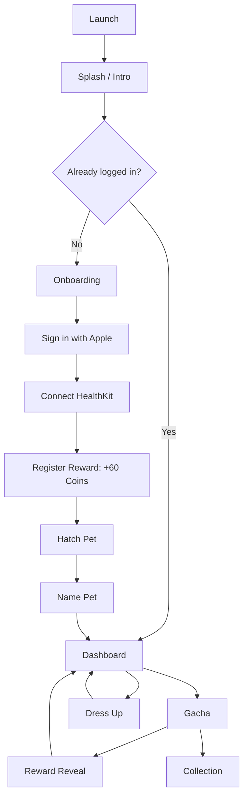

# FitChick

<p align="center">
  
</p>

<p align="center">
  <strong>Turn daily movement into a playful pet adventure.</strong>
</p>

<p align="center">
  
  
  
  
</p>

FitChick adalah aplikasi iOS yang mengubah kebiasaan bergerak menjadi pengalaman kecil yang terasa menyenangkan. User login dengan Apple, menghubungkan HealthKit, mendapatkan coin, menetaskan pet, memberi nama chick, lalu mengumpulkan item lewat gacha untuk mendandani pet mereka.

Di dalamnya ada kombinasi SwiftUI, SwiftData, HealthKit, AuthenticationServices, SpriteKit, asset-driven animation, custom design system, dan local persistence. Semua dibuat dengan arah yang jelas: aktivitas harian bukan cuma angka, tapi perjalanan yang hidup, lucu, dan punya reward.

## Highlight Fitur

- Onboarding bertahap dengan narasi ringan tentang movement, rewards, dan pet journey.
- Sign in with Apple untuk identitas user lokal.
- HealthKit integration untuk membaca step count dan walking/running distance harian.
- Daily progress dashboard dengan target step dan distance berlapis.
- Coin reward flow setelah user menghubungkan HealthKit.
- Hatch experience berbasis GIF asset untuk momen menetaskan pet pertama.
- Pet naming dengan SwiftData persistence.
- Dashboard pet dengan bubble chat, nama pet tersimpan, dan activity progress live.
- Gacha system 1x dan 5x draw dengan coin cost, reward animation, dan rare guarantee setiap 4 draw.
- Collection page untuk melihat item yang sudah terbuka dan masih terkunci.
- Dress-up page dengan preview pet real-time sebelum disimpan.
- SpriteKit chick rig untuk idle animation, blinking, beak motion, wings, feet, dan equipment sockets.
- Shared design system untuk color token, typography token, reusable buttons, sound effects, dan reward backgrounds.

## Tech Stack

| Area | Teknologi |
| --- | --- |
| UI | SwiftUI |
| Local data | SwiftData, `@AppStorage`, UserDefaults |
| Authentication | AuthenticationServices, Sign in with Apple |
| Secure storage | Keychain via `KeychainManager` |
| Health data | HealthKit |
| Animation | SwiftUI animation, GIF decoding with ImageIO, SpriteKit |
| Audio | AVFoundation, asset catalog datasets |
| Design system | Custom `AppColor`, `AppFont`, Sour Gummy variable font |
| Project type | Native Xcode project, no external package manager |

## App Flow



## Fitur Dalam Repo

### Onboarding dan Login

Entry point aplikasi ada di `FitChick/FitChickApp.swift` dan membuka `Onboarding`. Flow onboarding dimulai dari splash singkat, lalu membawa user ke rangkaian screen onboarding. Jika `isLoggedIn` sudah tersimpan, app langsung masuk ke `DashboardView`.

Login menggunakan `SignInWithAppleButton` di `LoginSheetView`. Setelah berhasil, app menyimpan `appleUserId`, nama, dan email ke Keychain, lalu mengaktifkan flag login lokal.

File utama:

- `FitChick/Features/Onboarding/Views/Onboarding.swift`
- `FitChick/Features/Onboarding/Views/Onboarding1.swift`
- `FitChick/Features/Onboarding/Views/Onboarding2.swift`
- `FitChick/Features/Onboarding/Views/Onboarding3.swift`
- `FitChick/Features/Login/Views/LoginSheetView.swift`
- `FitChick/Shared/Utilities/KeychainManager.swift`

### HealthKit dan Daily Progress

`HealthStore` meminta permission HealthKit dan membaca dua metrik utama:

- Step Count
- Walking/Running Distance

Dashboard mengambil data awal lewat async fetch, lalu mendengarkan update harian memakai `AsyncStream`. Target progress saat ini dibuat berlapis:

| Metric | Fine | Good | Excellent |
| --- | ---: | ---: | ---: |
| Steps | 8,000 | 10,000 | 12,000 |
| Distance | 6 km | 8 km | 10 km |

File utama:

- `FitChick/Features/ConnectHealth/Datas/HealthStore.swift`
- `FitChick/Features/ConnectHealth/Views/ConnectHealthView.swift`
- `FitChick/Features/Dashboard/Views/DashboardView.swift`
- `FitChick/Features/Dashboard/Views/DailyProgressSectionView.swift`
- `FitChick/Features/Dashboard/Views/DailyProgressCardView.swift`

### Reward, Coin, Hatch, dan Pet Name

Setelah HealthKit terhubung, user diarahkan ke reward register untuk mengklaim 60 coins. Dari sana user masuk ke hatch flow, melihat animasi telur, lalu memberi nama pet.

Nama pet disimpan sebagai `UserAccount.petName` lewat SwiftData. Dashboard membaca user yang sama berdasarkan `appleUserId`, sehingga bubble chat bisa menyapa pet dengan nama yang sudah disimpan.

File utama:

- `FitChick/Features/Reward/Views/RewardCoinRegister.swift`
- `FitChick/Features/Hatch/Views/HatchView.swift`
- `FitChick/Features/Hatch/Views/HatchAnimationView.swift`
- `FitChick/Features/NamePet/Views/NamePetCard.swift`
- `FitChick/Features/Login/Datas/UserAccount.swift`

### Gacha dan Collection

Gacha memakai coin lokal sebagai currency:

- 1x draw: 10 coins
- 5x draw: 50 coins
- Rare item diprioritaskan setiap 4 draw
- Item yang sudah didapat disimpan di `unlockedGachaItems`
- Gacha tidak akan menarik item yang sudah dimiliki

Saat case dibuka, SpriteKit menjalankan animasi closed, shaking, dan open. Reward ditampilkan dengan background berbeda untuk item regular dan rare.

File utama:

- `FitChick/Features/Gacha/Views/GachaView.swift`
- `FitChick/Features/Gacha/SpriteKit/CaseOpeningScene.swift`
- `FitChick/Features/Gacha/Views/GachaFiveRewardSequenceView.swift`
- `FitChick/Features/Reward/Views/RewardItem.swift`
- `FitChick/Features/Reward/Views/RewardRareItem.swift`
- `FitChick/Features/Collection/Views/CollectionView.swift`
- `FitChick/Domain/Catalogs/CollectionItem.swift`

### Pet Rendering dan Dress Up

Pet tidak hanya ditampilkan sebagai gambar statis. Dashboard dan dress-up preview memakai `PetSceneView`, yang membungkus `SpriteView` dengan `PetScene` dan `ChickRigNode`.

`ChickRigNode` membangun ayam dari texture atlas, lalu menjalankan idle animation:

- blinking eyes
- beak expression
- body breathing
- wing motion
- feet motion
- cockscomb wobble

Equipment dipasang lewat socket berdasarkan kategori:

- Head
- Face
- Body
- Neck

Dress-up page memakai draft state agar user bisa preview item dulu, lalu menyimpan perubahan hanya ketika menekan Save. Data equipment tersimpan di `@AppStorage` dengan key `equippedPetItems`.

File utama:

- `FitChick/Features/Pet/SpriteKit/PetScene.swift`
- `FitChick/Features/Pet/SpriteKit/ChickRigNode.swift`
- `FitChick/Features/Dashboard/Views/PetPreviewCard.swift`
- `FitChick/Features/DressUp/Views/DressUpPageView.swift`
- `FitChick/Shared/Components/Buttons/ItemGridButton.swift`

## Data dan Persistence

| Data | Storage | Key / Model |
| --- | --- | --- |
| Login status | `@AppStorage` | `isLoggedIn` |
| Apple user id | Keychain | `appleUserId` |
| Apple full name | Keychain | `appleUserFullName` |
| Apple email | Keychain | `appleUserEmail` |
| Pet name | SwiftData | `UserAccount.petName` |
| Coin count | `@AppStorage` | `coinCount` |
| Total gacha count | `@AppStorage` | `totalGachaCount` |
| Unlocked collection items | UserDefaults JSON | `unlockedGachaItems` |
| Equipped pet item | `@AppStorage` JSON | `equippedPetItems` |

## Struktur Project

```text
FitChick/
├── FitChickApp.swift
├── Info.plist
├── FitChick.entitlements
├── Domain/
│   └── Catalogs/
│       └── CollectionItem.swift
├── Features/
│   ├── Collection/
│   ├── ConnectHealth/
│   ├── Dashboard/
│   ├── DressUp/
│   ├── Gacha/
│   ├── Hatch/
│   ├── Login/
│   ├── NamePet/
│   ├── Onboarding/
│   ├── Pet/
│   └── Reward/
├── Shared/
│   ├── Components/
│   ├── DesignSystem/
│   ├── Utilities/
│   └── Views/
└── Resources/
    ├── Assets.xcassets/
    ├── ChickRig.atlas/
    ├── Fonts/
    ├── PetBlinkAnimation.gif
    └── BlackHatPetAnimation.gif
```

## Design System

FitChick punya design system lokal agar UI tetap konsisten dan mudah dirawat.

### Color

Semua warna utama dibungkus lewat `AppColor`, misalnya:

```swift
Text("Small steps, big changes")
    .foregroundStyle(AppColor.neutral600Subtext)

RoundedRectangle(cornerRadius: 10)
    .fill(AppColor.primary300Main)
```

Token warna tersedia untuk primary, secondary, neutral, success, error, violet, labels, fills, dan separators.

### Typography

Font utama adalah Sour Gummy variable font yang didaftarkan melalui `Info.plist`. Akses typography dilakukan lewat `AppFont`:

```swift
Text("Claim Reward")
    .font(AppFont.bodyBold)
    .kerning(AppFont.bodyBold.letterSpacing)
```

Dokumentasi singkat design system ada di:

```text
FitChick/Shared/DesignSystem/README.md
```

## Assets

Repo ini asset-heavy. Beberapa kelompok asset penting:

- `Logo`: logo FitChick dan Health.
- `Pet`: visual chick, egg stages, nest.
- `Items`: collectible equipment untuk gacha, collection, dan dress-up.
- `Background`: spotlight, reward background, shadow.
- `Animations`: hatch GIF dataset.
- `Sfx`: button, reward, dan pet sound effects.
- `ChickRig.atlas`: texture atlas untuk SpriteKit rig.
- `Fonts`: Sour Gummy regular dan italic variable fonts.

## Requirements

- macOS dengan Xcode yang mendukung project target ini.
- iOS deployment target di target app saat ini: `26.3`.
- Apple Developer account untuk menjalankan capability Sign in with Apple dan HealthKit di device.
- Device fisik direkomendasikan untuk pengujian HealthKit yang paling akurat.

## Cara Menjalankan

1. Clone repo ini.
2. Buka `FitChick.xcodeproj` di Xcode.
3. Pilih scheme `FitChick`.
4. Pastikan Signing & Capabilities aktif untuk:
   - Sign in with Apple
   - HealthKit
5. Pilih simulator atau device.
6. Jalankan dengan `Cmd + R`.

Build dari terminal juga bisa dilakukan dengan menyesuaikan nama simulator yang tersedia:

```bash
xcodebuild \
  -project FitChick.xcodeproj \
  -scheme FitChick \
  -destination 'platform=iOS Simulator,name=iPhone 16' \
  build
```

## Catatan Pengembangan

- Repo ini belum memakai dependency manager eksternal.
- State gacha, coin, unlocked item, dan equipped item masih disimpan secara lokal.
- HealthKit data di simulator bisa terbatas, terutama untuk data aktivitas nyata.
- Belum ada test target di repo saat ini.
- Bundle identifier target app saat ini adalah `com.hendrairawan.FitChick.dev`.
- Marketing version saat ini adalah `1.0`.

## Kontribusi

Kontribusi paling enak dimulai dari scope kecil dan jelas:

1. Buat branch baru untuk fitur atau fix.
2. Ikuti pola folder yang sudah ada di `Features`, `Shared`, dan `Domain`.
3. Gunakan `AppColor` dan `AppFont` daripada hardcode warna atau font.
4. Untuk UI reusable, tempatkan di `FitChick/Shared/Components`.
5. Untuk logic katalog atau model domain, cek dulu `FitChick/Domain`.
6. Jalankan build sebelum membuka pull request.

## Status

FitChick sedang aktif dikembangkan sebagai native iOS gamified health app. Fondasi onboarding, auth, HealthKit, dashboard, pet, gacha, collection, reward, dan dress-up sudah tersedia. Tahap berikutnya bisa diarahkan ke polishing flow, test coverage, richer reward economy, dan integrasi data yang lebih tahan lama.

## License

Belum ada file license publik di repo ini. Tambahkan `LICENSE` sebelum project didistribusikan secara terbuka.
